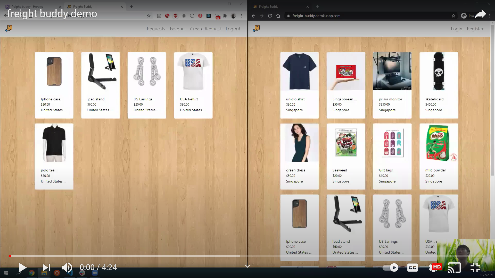
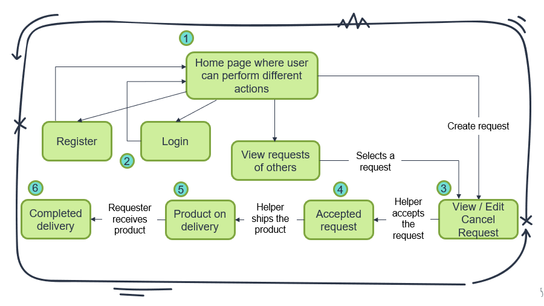

# Freight Buddy

Rocket Academy SWE1 Project 4: full-stack React app

## [Website](https://freight-buddy.herokuapp.com/)

## Technologies used

- Database: PostgreSQL
- Back-end framework: Express (Node.js)
- Front-end framework: React
- AJAX: Axios
- Other technologies: Sequelize, Webpack, Github, Heroku, Bootstrap, React-bootstrap, AWS S3

## About

An app that allows people (requesters) to enlist the help of others (helpers) overseas to purchase products from those overseas countries and ship them to the requesters' country.

## Demo Video on how to use Freight Buddy

Click the gif below to view the demo of freight buddy

## User Stories

1. The homepage where a user can login, register, view requests of others or create a request.
2. The user clicks on the register or login link in the homepage and is redirected to the registration or login page respectively.
3. The user clicks on a request in the homepage or creates a request and is redirected to a page that renders a request’s details. If the request was not created by the user, the user can accept the request. If the request was created by the user, the user can cancel the request.
4. The user decides to accept the request and is now a helper of that request.
5. After shipping the product, the helper updates the status of the request on the app.
6. After receiving the product, the requester updates the status of the request to complete the whole process.
